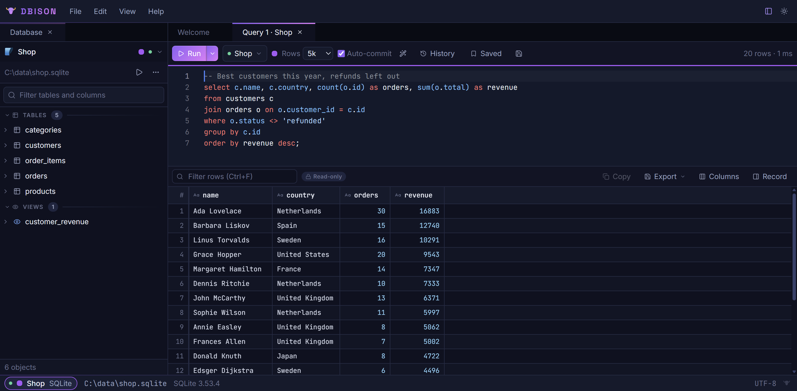
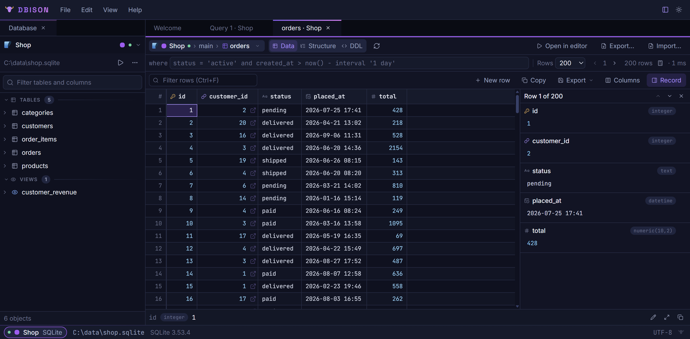
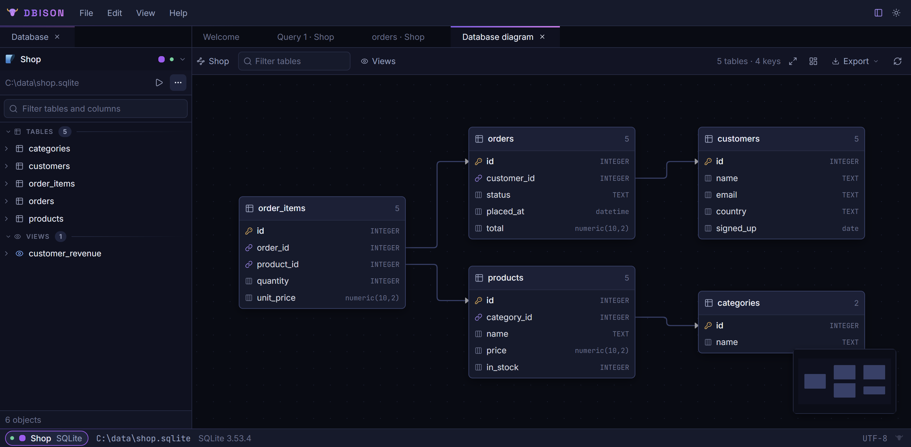

  

<h1 align="center">DBison</h1>

  A desktop database client for PostgreSQL, MySQL, MariaDB and SQLite that stays out of the way.

  
  
  

  <a href="https://dbison.app"><b>Download</b></a> ·
  <a href="#features">Features</a> ·
  <a href="docs/DEVELOPMENT.md">Build from source</a> ·
  <a href="CONTRIBUTING.md">Contributing</a> ·
  <a href="#support-dbison">Support</a>

<picture>
  <source media="(prefers-color-scheme: light)" srcset="docs/screenshots/query-light.png">
  
</picture>

## Why DBison

- **One window, no clutter.** One explorer, a query editor that knows your schema, and a grid you edit in place.
- **Keyboard first.** A command palette (Ctrl+K), a fuzzy filter over every object, and shortcuts for everything you do often.
- **Safe by default.** A DELETE or UPDATE without a WHERE asks first, read-only connections are enforced by the app itself, and every schema change shows its SQL before it runs.
- **Private.** No account, no telemetry, no ads. Passwords are kept in your operating system's keychain.
- **Open source.** Released under the [AGPL-3.0](LICENSE), so you can read every line that touches your credentials.

## Download

Get the installer for Windows, macOS (Apple silicon) or Linux (`.deb` and `.rpm`) from **[dbison.app](https://dbison.app)**. Installed copies update themselves.

## Features

### Queries

- **Query editor** (Monaco) with completions drawn from the live schema and JOIN suggestions that follow foreign keys.
- Run the statement at the cursor, or a whole script with one result tab per statement.
- **EXPLAIN**, with a visual plan tree that shows rows, cost and time per step.
- Bind parameters, manual transactions, formatting, history and `.sql` files.
- **Saved queries**: name a statement, tag it, and keep it for one connection or all of them.

### Data

- A **grid** that stages your edits and writes them in one transaction.
- Quick filters, selection statistics, pinned columns, and a value viewer with a JSON tree and image preview.
- Copy as INSERT, Markdown, JSON or CSV, and paste straight from a spreadsheet.
- **Table tabs** with a WHERE box, server-side sorting and paging, and an exact row count on demand.
- **Record view** (F4) shows the focused row as a form beside the grid.
- **Import** a CSV or other delimited file into a table with column mapping. **Export** every row of a table or result to CSV, TSV, JSON or SQL INSERTs, streamed past the grid's row limit.

### Schema

- **Relationship diagram** of the whole database, exportable as SVG or PNG. Positions you drag are remembered.
- **Structure and DDL** views for every table.
- **Structure editing**: add, rename, change and drop columns; create and drop indexes; rename, drop and create tables from a form.
- **Backup and restore** through the engine's own tools (pg_dump/psql, mysqldump/mysql, sqlite3), with the connection's settings and tunnel.

### Connections

- SSL with certificate verification, SSH tunnels, and connection URLs you can paste.
- A colour and a read-only mark per connection. The read-only mark is enforced by the app's core process, not just the dialog.
- Folders, duplication, and import and export of profiles: the app's own JSON, `.pgpass`, or a list of URLs.

### Workspace

- Tabs and splits that survive restarts, zoom, and light and dark themes.
- Unsaved work asks before a tab or the window closes.
- A log file (Help ▸ Open Log Folder) that catches errors, for when something goes wrong.

## Contributing

Bug reports, ideas and pull requests are welcome; start with [CONTRIBUTING.md](CONTRIBUTING.md). To run DBison from source, see [docs/DEVELOPMENT.md](docs/DEVELOPMENT.md). Please report security problems privately, as described in [SECURITY.md](SECURITY.md).

## Support DBison

DBison is built by one person. If it saves you time, you can support it through [GitHub Sponsors](https://github.com/sponsors/janvorisek) or [Ko-fi](https://ko-fi.com/janvorisek), or with Bitcoin from Help ▸ Support DBison in the app. A star on GitHub helps too.

## Licence

Copyright © 2026 Jan Vorisek.

DBison is free software: you can redistribute it and/or modify it under the terms of the [GNU Affero General Public License, version 3](LICENSE), as published by the Free Software Foundation. It is distributed in the hope that it will be useful, but without any warranty; without even the implied warranty of merchantability or fitness for a particular purpose.

For licensing under other terms, such as a commercial licence, contact jan@vorisek.me.
